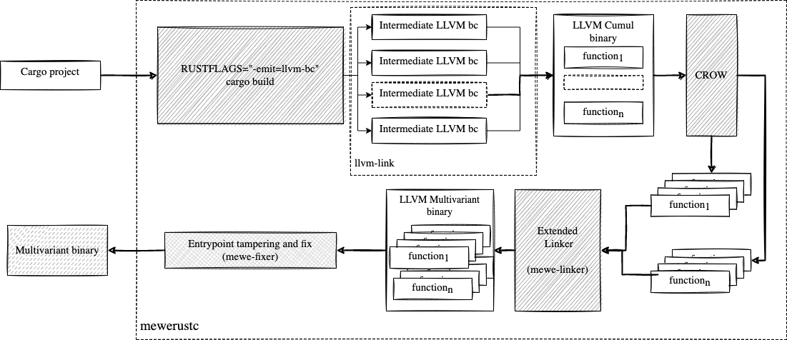

# MEWE

MEWE is a toolset and methodology tailored to provide multivariant execution.


```bibtex
@article{arteaga2021multi,
  title={Multi-Variant Execution at the Edge},
  author={Arteaga, Javier Cabrera and Laperdrix, Pierre and Monperrus, Martin and Baudry, Benoit},
  journal={arXiv preprint arXiv:2108.08125},
  year={2021}
}
```

## Requirements

MEWE supports rust based projects for now and uses the LLVM toolchain to generate the multivariant binaries. Here you can find the whole list of dependencies you should install in your local pc.

- docker
- LLVM toolchain, version 12 or 13
- cargo and rust compiler

## Try it out

The following example generates a multivariant binary that can execute in your local machine. Make sure you have the LLVM toolchain in your system version 12.

```bash
git clone https://github.com/Jacarte/MEWE
cd MEWE
source mewe.sh
cd examples/simple
mewerustc  --llvm-version 12 --generation-timeout 3600 --exploration-timeout 120
```

Look for examples [here](examples)

# Extended linker and multivariant generation

Our [linker](multivariant-mixer) takes a collection of LLVM libraries as input and outputs a big library containing semantically equivalent functions (yet statically different) for which we orchestrate their execution at runtime.

 
# MEWE multivariants

With our linker, you can start creating multivariant libraries. To do so, you need to be able of creating semantically equivalent functions out of the original library. A previous [work of us](https://github.com/KTH/slumps/tree/master/crow) uses a superoptimizer to create a handful number of variants out of a single LLVM bitcode. We provide an [example](examples/calling_crow) about how to use CROW to generate variants.

Notice that, this approach will work with any diversifier, as soon as it fits with our linker in terms of binary correctness. 

# MEWE pipeline

MEWE uses an extended LLVM linker and CROW to build multivariant binaries. In the following diagram, we dissect how it works. 

MEWE first compiles the cargo based project collecting their intermediate LLVM bitcodes. The collected bitcodes are linked together to build a cumulative LLVM bitcode containing the full cargo application. MEWE then makes a CROW-pass to generate the program variants. 
The variants are passed to our linker to generate the multivarint LLVM bitcode.
MEWE fixes the generated LLVM bitcode depending on the compilation target. 
For example, for was32-wasi target, MEWE, tampers the entrypoint of the multivariant LLVM bitcode and creates a new cargo project that calls this new function. The final stage, is the regular compiler, which understands the missing dependencies and creates the final valid binary.



# License

This project is licensed under the MIT license. See [LICENSE](LICENSE.md) for more details.