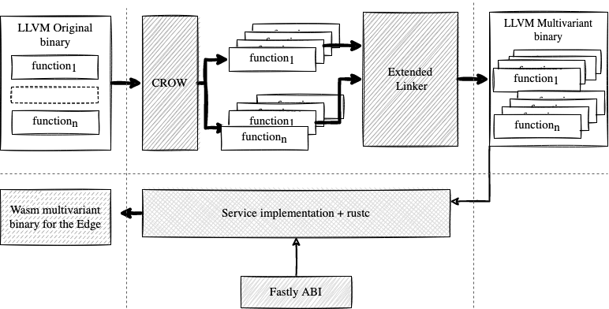

# MEWE

MEWE is a toolset and methodology tailored to provide multivariant execution.

# Extended linker and multivariant generation

Our [linker](multivariant-mixer) takes a collection of LLVM libraries as input and outputs a big library containing semantically equivalent functions (yet statically different) for which we orchestrate their execution at runtime.

 
# MEWE multivariants

With our linker, you can start creating multivariant libraries. To do so, you need to be able of creating semantically equivalent functions out of the original library. A previous [work of us](https://github.com/KTH/slumps/tree/master/crow) uses a superoptimizer to create a handful number of variants out of a single LLVM bitcode. We provide an [example](examples/calling_crow) about how to use CROW to generate variants is available.

Notice that, this approach will work with any diversifier, as soon as it fits with our linker in terms of binary correctness. 

# Walkthrough

To create multivariant programs we follow the next steps:

1. Generate the library variants.
2. Call our linker to generate the multivariant library.
3. Glue the multivariant library with an entrypoint, e.g. an executable.

Look for examples [here](examples)

# Multivariant binaries at the Edge

With MEWE, we use an extended LLVM linker, CROW and the Fastly ABI to also provide WebAssembly multivariant binaries that can be successfully deployed to the Fastly's platform. 

We created a proof of concept of deploying multivariants at the Edge (see the [fastly](fastly) folder), specifically at the Fastly platform. We create multivariant libraries for `libsodium` and a `qrcode_generator`. Then, we pass the generated multivariant libraries to the `rustc` compiler during compiling to generate a valid executable Wasm binary (according to the Fastly ABI). We followed the walktthrough previously mentioned.

1 - Each project folder(`fastly/link_sodium` and `fastly/link_qrcode`) contains the corresponding scripting to collect the LLVM bitcodes to diversify and merge with MEWE:
- **link_qrcode**: In this case we intercept the intermediate bitcodes generated by rustc, and we then take them as the target for diversification. We collect them by running `python rust/build.py` in the `fastly/link_qrcode` folder.

- **link_sodium**: We take the bitcode generated from the compilation of the libsodium project as the target for diversification. The file could be found at `inlined/original/allinone.bc`.

2 - We generate semantically equivalent variants from the functions inside the collected bitcodes. We use CROW for such task, we pass the collected bitcodes to CROW, and we collect the generated variants.

3 - After collecting the variants we merge them with our linker into multivariant libraries. 

4 - The multivariant libraries can be then used by any LLVM-like compiler. 

5 - We use `rustc` to link the multivariant libraries to 7 endpoints to be deployed as functions in the Fastly's platform. 

We follow a similar approach in the [calling_crow](examples/calling_crow) example.

# License

This project is licensed under the MIT license. See [LICENSE](LICENSE.md) for more details.